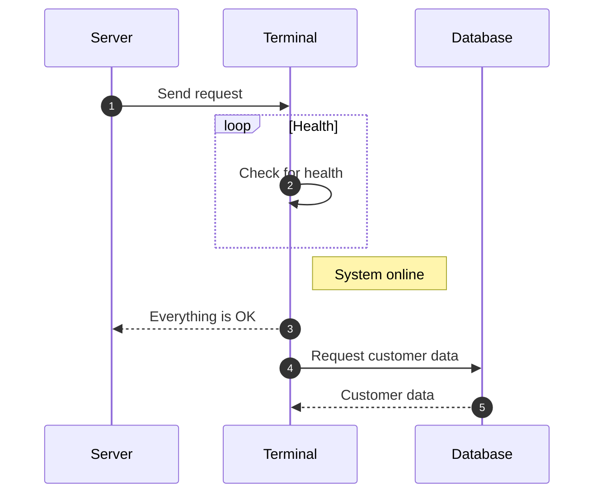
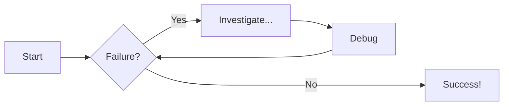

# Examples
## Sequence Diagrams




## Flowcharts



## MkDocs Page Structure Fundamentals

MkDocs follows a straightforward approach to documentation organization. The basic structure centers around Markdown files in your `docs` directory, with each `.md` file becoming a page in your documentation. For example, `docs/getting-started.md` becomes a page accessible at `/getting-started/` in your built site.

### Creating New Pages

To create a new page, simply add a Markdown file to your `docs` directory. The file should begin with a level-1 heading (`# Title`) which becomes the page title. The content follows standard Markdown formatting:

```markdown
# Getting Started

This is the content of your new page.

## Subsection

More content here.
```

### Organizing Documentation Sections

To create sections in MkDocs, create subdirectories within your `docs` folder. For example:

```
docs/
├── index.md
├── getting-started.md
├── features/
│   ├── feature1.md
│   └── feature2.md
└── api/
    ├── overview.md
    └── endpoints.md
```

Each subdirectory typically represents a section in your documentation's navigation.

### Navigation Configuration

MkDocs offers two approaches to configure navigation:

1. **Automatic** (default): MkDocs creates navigation based on your directory structure
2. **Manual**: Define your navigation structure explicitly in `mkdocs.yml`

For more control, use the manual approach by adding a `nav` section to your `mkdocs.yml`:

```yaml
nav:
  - Home: index.md
  - Getting Started: getting-started.md
  - Features:
    - Overview: features/overview.md
    - Feature 1: features/feature1.md
    - Feature 2: features/feature2.md
  - API Reference:
    - Overview: api/overview.md
    - Endpoints: api/endpoints.md
```

This configuration allows you to customize section titles, page ordering, and create nested navigation structures that don't necessarily match your directory structure.

### Industry Best Practices

Documentation professionals typically favor explicit navigation configuration over automatic structure generation. Manual navigation in `mkdocs.yml` provides precise control over the user experience and enforces intentional information architecture decisions.

### File Organization Patterns

Expert documentation teams follow a "docs-as-code" approach with these common patterns:
1. **Task-based organization** rather than feature-based organization (focusing on what users need to accomplish)
2. **Progressive disclosure** with a logical learning path from basics to advanced topics
3. **Shallow hierarchy** limiting navigation to 2-3 levels deep to prevent cognitive overload
4. **Consistent naming conventions** for files and directories (typically kebab-case: `getting-started.md`)

### Navigation Configuration Best Practices

Professional documentation developers almost universally prefer explicit navigation:

```yaml
nav:
  - Home: index.md
  - Getting Started: 
    - Quick Start: getting-started/quick-start.md
    - Installation: getting-started/installation.md
  - User Guide:
    - Overview: user-guide/index.md
    - Core Concepts: user-guide/concepts.md
```

This approach allows documentation to evolve independently from file structure and enables strategic organization of content based on user needs rather than implementation details.

### File Naming Conventions

Professional documentation teams adhere to specific naming patterns for clarity and consistency:

1. **Kebab-case filenames**: The dominant convention in documentation platforms
   - `getting-started.md`, `api-reference.md`, `advanced-configuration.md`
   - Preferred over camelCase or snake_case for improved readability

2. **Descriptive but concise**: 2-4 words maximum
   - Good: `authentication-flow.md`
   - Avoid: `how-to-set-up-and-configure-the-authentication-system.md`

3. **All lowercase**: Prevents cross-platform path issues

### Section Naming Standards

For heading structure within documentation:

1. **Title Case for H1/H2 headings**: "Getting Started," "API Reference"
2. **Sentence case for H3 and below**: "Installing on Windows," "Environment variables"
3. **Verb-first for task-based sections**: "Configuring authentication," "Deploying to production"
4. **Noun-first for concept sections**: "Authentication overview," "Architecture principles"

### Directory Organization Principles

Expert documentation teams organize directories following these patterns:

```
docs/
├── index.md                # Landing page
├── getting-started/        # First user experience
│   ├── installation.md     # Task-based content
│   └── configuration.md
├── guides/                 # Task-oriented content
│   ├── authentication.md
│   └── deployment.md
├── concepts/               # Understanding-oriented content
│   ├── architecture.md
│   └── security-model.md
└── reference/              # Lookup-oriented content
    ├── api.md
    └── configuration-options.md
```

This four-part structure (Getting Started, Guides, Concepts, Reference) represents the "Documentation System" pattern widely adopted by technology companies like Google, Stripe, and Microsoft for technical documentation.